# Mindful Meal Planner 
### Team members:
1. Son Tung Huynh, <tungh@sfu.ca>
2. Peter Tran, <ttt13@sfu.ca>
3. Jacky Cao, <jjc44@sfu.ca>
4. Jesse Zhou, <zza112@sfu.ca>
5. Arlen Xu, <arlenx@sfu.ca>

## Initialization
For the initialization, the user is allowed to log in with Gmail, or a regular email. If the already exists, then only the password will be required. 
 | 

Otherwise, the user will be asked to create a password, select their gender, and enter their initial meal plan. The user will be aided with some preset meal plans. From there, the user may adjust their meal plan more precisely.

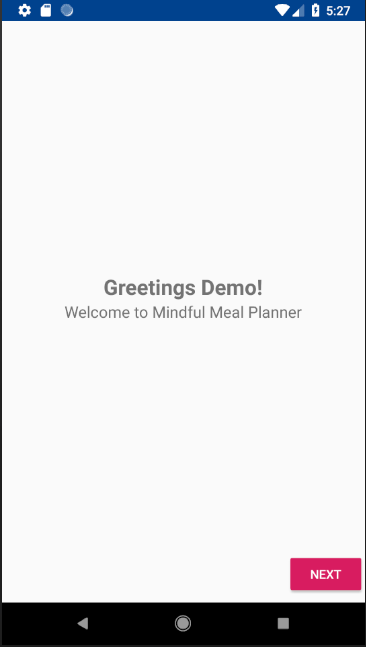 |  | 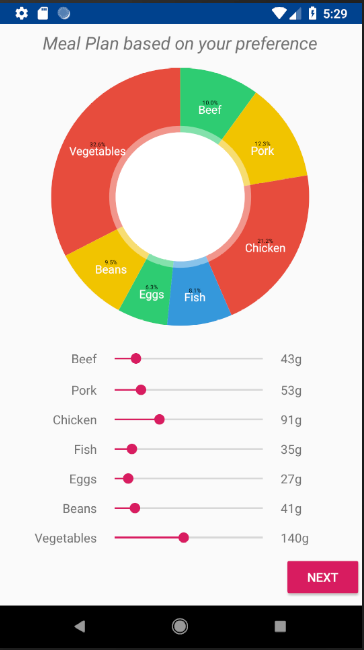

## Tutorial
Upon the first use, tutorial pop ups will occur in different fragments to help the user understand the purpose and different usages of the application. If the user wishes to revisit tutorials, they may click on the question mark icon found in several fragments.

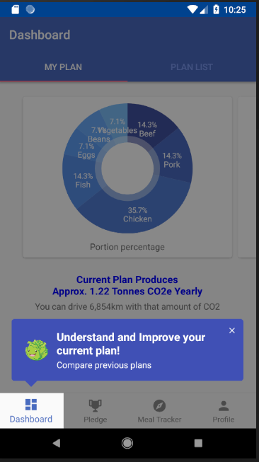 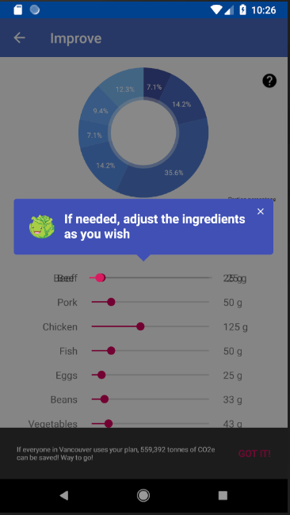

## Dashboard Activity
This dashboard activity provides the user a visual as well as information about their current meal plan and its impact on the environment. Furthermore, the user may view a list of their different saved meal plans.

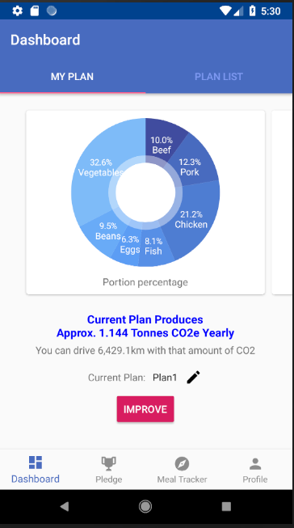 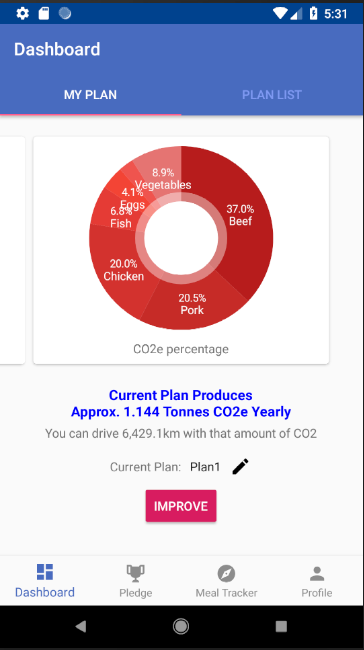 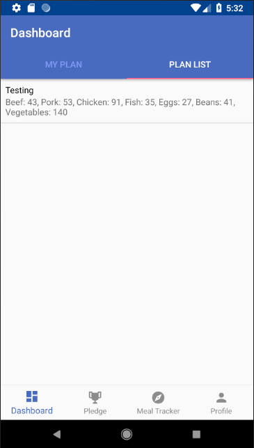

The user can alternate between two pie charts by swiping right or left. The blue pie chart indicates the percentage of each portion in the user's diet. The red pie chart indicates how much each portion contributes to the production of CO2e.
On pressing the edit icon, the user may change the name of their plan if they wish.
The user is also given information about approximately how many metric tonnes of CO2e are created from the current food plan, and the equalancy of how many kilometers an average car could drive to produce that amount.
The user's current plan is also displayed. 

## Improve Plan
This activity is reached by pressing the 'Improve' button seen in the dashboard. Here, a new plan is displayed for the user. This plan is generated by an algorithm that seeks to reduce the user's CO2e by 10%. To do this, it uses a scaling factor to slightly adjust each of the user's food portions, starting with those which produce the most CO2e.
A toast will be generated to inform the user how much CO2e could be reduced if all of Metro Vancouver were to use the same plan.

If the user is satisfied with this new plan. The user can press either 'save' or 'save as', where the latter button allows the ability to change the plan name.
If the user wishes to edit the plan, the user may use the sliders and update the amount of CO2e saved in real time. If the plan produces a greater amount of CO2e than the previous plan, the pie graph will turn red as a warning indication.

## Pledge 
The pledge activity has two fragments. The 'My Pledge' fragment allows the user to make a pledge of how many kilograms of CO2 they will commit to saving in a week. The 'Discover' fragment allows the user to see other users and their pledges, as well as various statistics on the pledges. The user may also filter pledges by municipality.

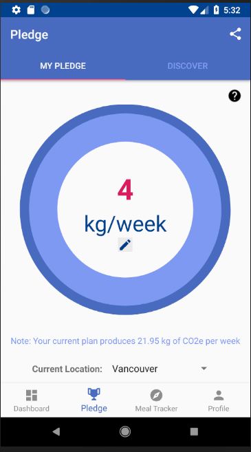 

## Meal Tracker
The meal tracker fragment allows users to explore different green meals posted by other Vancouverites. Users may post their green meal, in which it requires them to enter meal details, and upload a photo.

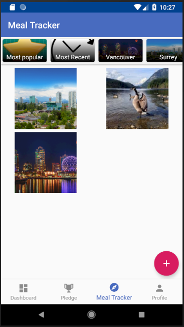  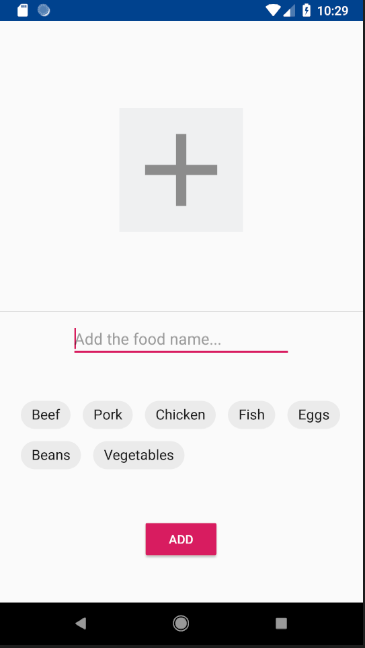

The database keeps record of green restaurants and their menus across Metro Vancouver. Upon selecting these items, tags will be set, so that the meals may be searched by other users.

## Profile
Users may view their profile. Upon clicking on their information, they can enter a profile account information activity, where the profile picture may be edited.

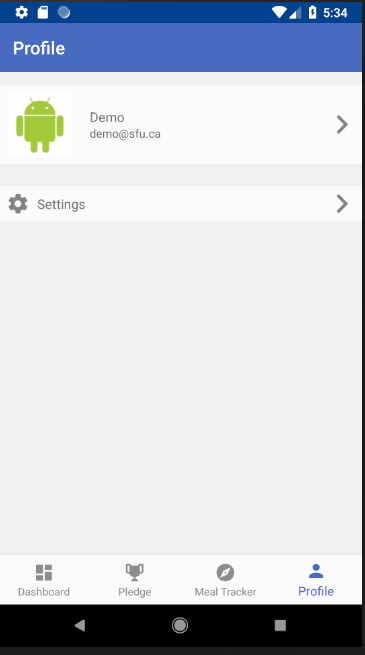 

## Settings 
This activity is accessed through the profile fragment. It contains access to the about page activity and an option to log out. Upon logging out, the application will close. The back button in the top left corner takes the user back to the dashboard.

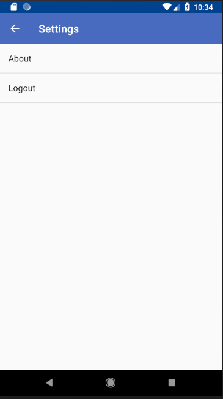 

